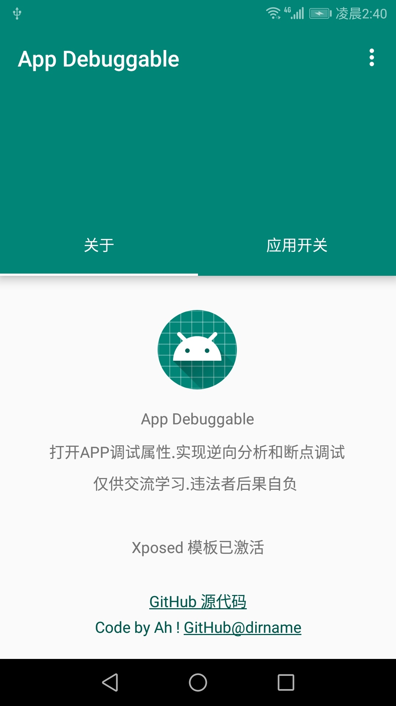
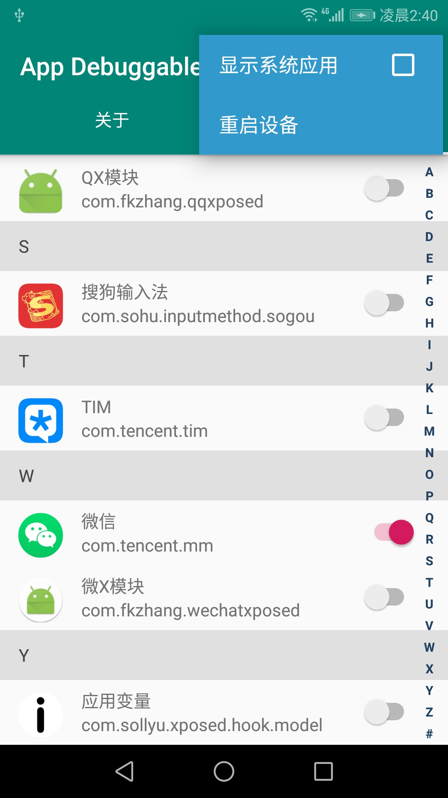
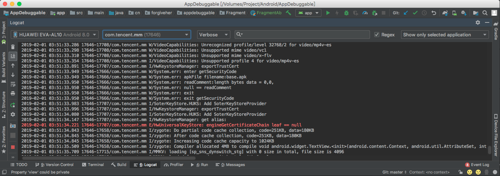
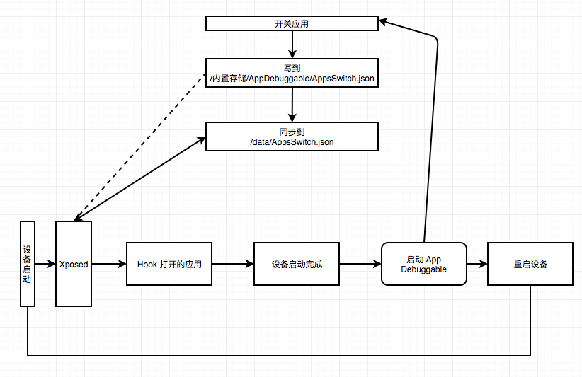

# App Debuggable

+ 测试 Android 设备 Huawei EVA-AL10
+ Android 设备版本 8.0.0
+ 最小 SDK版本 21
+ Gradle 4.10.1
+ Android Plugin Version 3.3.0
+ Kotlin 1.3
+ Android 设备 Xposed 版本 90-beta3

> 引用项目 [CoordinatorTabLayout](https://github.com/hugeterry/CoordinatorTabLayout)

# 使用步骤

## 运行

在 Xposed 中激活 App Debuggable 并运行. 需要申请root权限和储存权限

## 应用开关

应用开关中开关需要打开调试的应用

## 重启生效

选择完应用后，重启设备，随后在 Logcat 中选择打开的应用

# 为什么要请求 root ?

Xposed 会在设备启动时加载，此时 `XSharedPreferences` 或 `ContentProvider` 无法工作.因此需要同步一份配置文件至 `/data/` 并在设备启动时读取它

当然如果你有更好的方式读取配置文件，可以联系我的邮箱

App Debuggable 流程图

